# MusiCue FM

<p align="right"><a href="./README.zh-CN.md">简体中文</a></p>

<p align="center">
  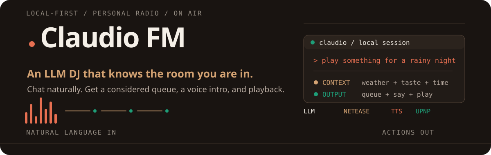
</p>

<p align="center">
  <strong>Say what you feel. Cue the right music.</strong><br>
  Its LLM understands open-ended requests, mood, time, weather, and listening context, then builds a queue that can follow a gradual emotional arc.
</p>

<p align="center">
  <a href="https://github.com/HP-Patience/MusiCue/stargazers"></a>
  <a href="https://github.com/HP-Patience/MusiCue/network/members"></a>
  <a href="https://github.com/HP-Patience/MusiCue"></a>
  <a href="https://github.com/HP-Patience/MusiCue/commits/master"></a>
  <a href="https://github.com/HP-Patience/MusiCue/issues"></a>
</p>

## From Request to Playback

Ask for a precise song, describe a scene, or simply say how you feel. Claudio turns the request into music search queries, finds matching tracks, responds as your personal DJ, and starts playback in the same interface.

<p align="center">
  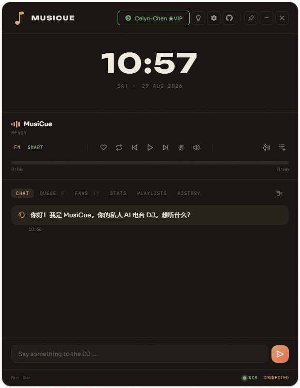
</p>

## Modes & Memory

<table>
  <tr>
    <td width="50%" valign="top">
      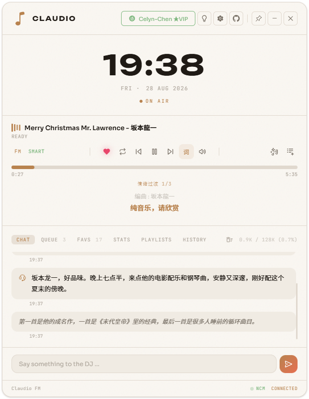
      <strong>Light player</strong><br>
      A focused playback surface with lyrics, controls, and the live conversation.
    </td>
    <td width="50%" valign="top">
      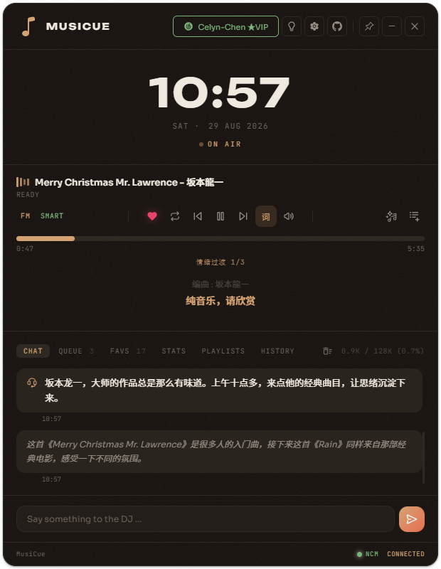
      <strong>Dark player</strong><br>
      The same local-first workflow in the project's dark listening mode.
    </td>
  </tr>
  <tr>
    <td width="50%" valign="top">
      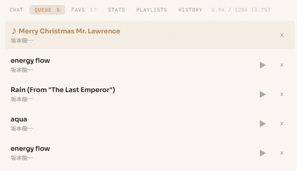
      <strong>Queue</strong><br>
      Inspect upcoming tracks, start one immediately, or remove it from the queue.
    </td>
    <td width="50%" valign="top">
      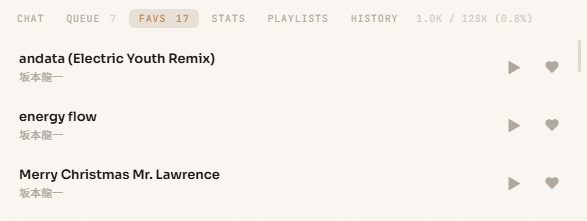
      <strong>Favorites</strong><br>
      Keep saved tracks close and send them back into playback when needed.
    </td>
  </tr>
  <tr>
    <td width="50%" valign="top">
      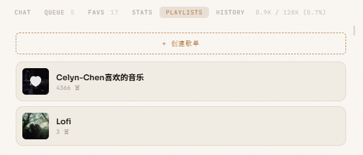
      <strong>Playlist library</strong><br>
      Browse personal playlists and create a new collection from the same interface.
    </td>
    <td width="50%" valign="top">
      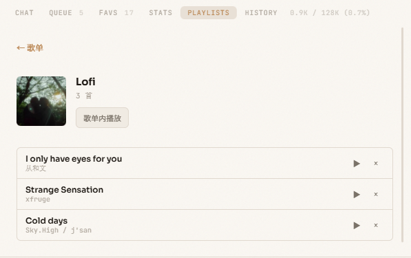
      <strong>Playlist detail</strong><br>
      Open a collection, inspect its tracks, and play the whole list or one song.
    </td>
  </tr>
  <tr>
    <td width="50%" valign="top">
      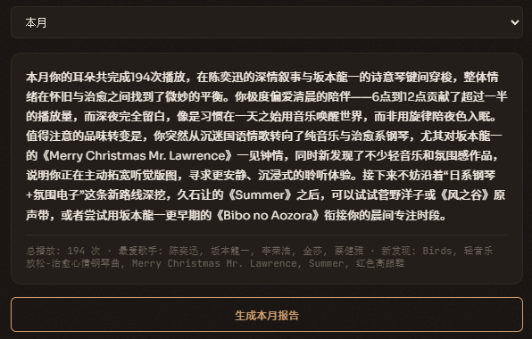
      <strong>Listening report</strong><br>
      Review listening patterns and generate an LLM report from local history.
    </td>
    <td width="50%" valign="top">
      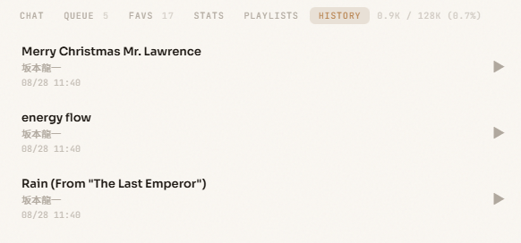
      <strong>History</strong><br>
      Revisit the tracks that shaped the recent listening context.
    </td>
  </tr>
</table>

## Progress & Roadmap

- [x] **Natural-language playback** — Convert conversational requests into search queries, find matching tracks, build a queue, and start playback.
- [x] **Context-aware selection** — Add time, weather, calendar, routines, and personal taste to the LLM context before choosing music.
- [x] **Mood-aware listening arcs** — Guide mood-oriented requests through a gradual emotional progression instead of jumping to an abrupt opposite mood.
- [x] **Listening statistics** — Aggregate plays by week, month, quarter, or year, including top artists, top songs, listening hours, and new discoveries.
- [x] **LLM listening reports** — Turn a selected period's statistics into a short report about habits, taste changes, and possible listening directions.
- [ ] **Persistent taste memory** — Extract durable taste signals from each generated report, save them as listening memory, and inject that memory into future LLM prompts so recommendations improve over time.

## How It Works

<p align="center">
  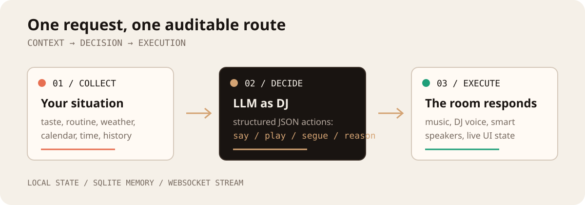
</p>

1. **Understand the request** instead of requiring an exact song title. The LLM converts conversational intent into structured actions and music search queries.
2. **Collect context** from `user/` plus weather, calendar, time, recent conversation, and mood guidance.
3. **Find and play music** through NetEase Cloud Music, then stream queue, playback, and optional TTS updates to the interface.
4. **Learn from listening history** by aggregating a selected period and asking the LLM to explain the listener's habits and taste. Persistent prompt memory from these reports is the next planned step.

The server keeps the orchestration in one auditable path. Simple transport commands such as `next`, `pause`, and `resume` can be handled locally; open-ended requests go through the configured OpenAI-compatible LLM endpoint.

## Quick Start

### 1. Start the NetEase Cloud Music API

Claudio requires [NeteaseCloudMusicApiEnhanced](https://github.com/547174207/NeteaseCloudMusicApiEnhanced) as a separate service:

```bash
cd api-enhanced
npm install
PORT=3001 node app.js
```

### 2. Start Claudio

From the repository root:

```bash
npm install
npm run dev
```

Open [http://localhost:3005](http://localhost:3005). On Windows, `start-claudio.bat` starts both services with readiness polling.

### 3. Configure the first session

1. Open **Settings**.
2. Enter the API key for your OpenAI-compatible LLM endpoint.
3. Set the base URL and model when needed.
4. Use **Test Connection**, then **Save**.
5. Ask the DJ for something to hear, such as `play something for a rainy night`.

## Capabilities

- Conversational music requests without requiring an exact song title.
- Automatic conversion from intent to music search queries and playback.
- Mood-aware, gradual listening arcs for emotional requests.
- DJ voice announcements through Fish Audio TTS.
- Normal, SMART, and NetEase Private FM playback modes.
- Local user corpus for taste, routines, mood rules, and playlists.
- Weather and Feishu calendar context for scene suggestions.
- Queue, favorites, hidden songs, history, and playlists.
- Weekly, monthly, quarterly, and yearly listening statistics with LLM-generated reports.
- Optional UPnP control for compatible speakers and devices.
- PWA shell and Electron desktop packaging for Windows.

## User Corpus

The files in `user/` shape the DJ's choices without changing application code:

| File | Purpose |
| --- | --- |
| `taste.md` | Artists, genres, preferences, and dislikes |
| `routines.md` | Regular daily routines and listening moments |
| `mood-rules.md` | Rules connecting moods or situations to music |
| `playlists.json` | Personal playlist data |

Set `USER_CORPUS_DIR` to use a different corpus directory, or configure it through the settings panel.

## Stack

| Layer | Technology |
| --- | --- |
| Runtime | Node.js + TypeScript with `tsx` |
| Server | Express 5 + native HTTP server |
| Real-time | WebSocket (`ws`) at `/stream` |
| State | SQLite through `better-sqlite3` |
| LLM | OpenAI-compatible API |
| Frontend | Vanilla JavaScript, HTML, CSS, and PWA APIs |
| Tests | Vitest + supertest |

## Commands

```bash
npm run dev          # start the server on port 3005
npm test             # run the full test suite
npm run test:watch   # watch tests
npm run build        # build the server and Electron process
npm run dev:desktop  # build and launch the Electron app
npm run dist:win    # build a Windows installer
```

## Configuration

Configuration is shared between the `.env` file and the SQLite `prefs` table. Database values take priority. The settings panel can write the main runtime values, or use `POST /api/config` and `POST /api/config/test` directly.

Common integrations:

- LLM: an OpenAI-compatible endpoint.
- Music: the local NetEase Cloud Music API service at `http://localhost:3001`.
- Weather: the configured weather provider key.
- Voice: Fish Audio API key.
- Calendar: Feishu App ID and App Secret.
- Devices: a JSON list of UPnP devices.

## Documentation

- [User manual](docs/user-manual.md) — setup, interface, playback modes, commands, and integrations.
- [Development reference](CLAUDE.md) — architecture, data flow, constraints, and development notes.

## License

See the repository for the current license and distribution terms.
