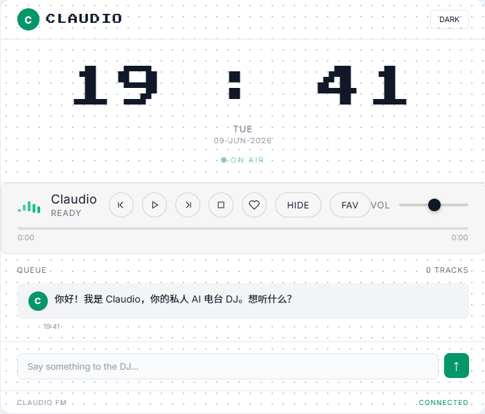

# Claudio FM

<p align="right"><a href="./README.zh-CN.md">简体中文</a></p>

<p align="center">
  
</p>


<p align="center">
  <strong>For people who want music to fit the moment, Claudio FM turns a natural-language request into a considered queue with a spoken DJ intro.</strong><br>
  It collects your taste, routine, weather, calendar, time, and playback history, then routes the result to NetEase Cloud Music, TTS, and optional UPnP speakers.
</p>

<p align="center">
  <a href="https://github.com/HP-Patience/Claudio/stargazers"></a>
  <a href="https://github.com/HP-Patience/Claudio/network/members"></a>
  <a href="https://github.com/HP-Patience/Claudio"></a>
  <a href="https://github.com/HP-Patience/Claudio/commits/master"></a>
  <a href="https://github.com/HP-Patience/Claudio/issues"></a>
</p>

## See It

<p align="center">
  
</p>

Claudio is designed as a quiet local player: the interface shows the current track, queue, chat, connection state, and controls in one surface.

## How It Works

<p align="center">
  
</p>

1. **Collect context** from `user/` plus weather, calendar, time, and playback history.
2. **Ask the LLM** to interpret the request and return structured actions such as `say`, `play`, `reason`, and `segue`.
3. **Execute the route** through NetEase Cloud Music, Fish Audio TTS, WebSocket updates, and optional UPnP devices.

The server keeps the orchestration in one auditable path. Simple transport commands such as `next`, `pause`, and `resume` can be handled locally; open-ended requests go through the configured OpenAI-compatible LLM endpoint.

## Quick Start

### 1. Start the NetEase Cloud Music API

Claudio requires [NeteaseCloudMusicApiEnhanced](https://github.com/547174207/NeteaseCloudMusicApiEnhanced) as a separate service:

```bash
cd api-enhanced
npm install
PORT=3001 node app.js
```

### 2. Start Claudio

From the repository root:

```bash
npm install
npm run dev
```

Open [http://localhost:3005](http://localhost:3005). On Windows, `start-claudio.bat` starts both services with readiness polling.

### 3. Configure the first session

1. Open **Settings**.
2. Enter the API key for your OpenAI-compatible LLM endpoint.
3. Set the base URL and model when needed.
4. Use **Test Connection**, then **Save**.
5. Ask the DJ for something to hear, such as `play something for a rainy night`.

## Capabilities

- Natural-language music requests with context-aware selection.
- DJ voice announcements through Fish Audio TTS.
- Normal, SMART, and NetEase Private FM playback modes.
- Local user corpus for taste, routines, mood rules, and playlists.
- Weather and Feishu calendar context for scene suggestions.
- Queue, favorites, hidden songs, history, playlists, and playback statistics.
- Optional UPnP control for compatible speakers and devices.
- PWA shell and Electron desktop packaging for Windows.

## User Corpus

The files in `user/` shape the DJ's choices without changing application code:

| File | Purpose |
| --- | --- |
| `taste.md` | Artists, genres, preferences, and dislikes |
| `routines.md` | Regular daily routines and listening moments |
| `mood-rules.md` | Rules connecting moods or situations to music |
| `playlists.json` | Personal playlist data |

Set `USER_CORPUS_DIR` to use a different corpus directory, or configure it through the settings panel.

## Stack

| Layer | Technology |
| --- | --- |
| Runtime | Node.js + TypeScript with `tsx` |
| Server | Express 5 + native HTTP server |
| Real-time | WebSocket (`ws`) at `/stream` |
| State | SQLite through `better-sqlite3` |
| LLM | OpenAI-compatible API |
| Frontend | Vanilla JavaScript, HTML, CSS, and PWA APIs |
| Tests | Vitest + supertest |

## Commands

```bash
npm run dev          # start the server on port 3005
npm test             # run the full test suite
npm run test:watch   # watch tests
npm run build        # build the server and Electron process
npm run dev:desktop  # build and launch the Electron app
npm run dist:win    # build a Windows installer
```

## Configuration

Configuration is shared between the `.env` file and the SQLite `prefs` table. Database values take priority. The settings panel can write the main runtime values, or use `POST /api/config` and `POST /api/config/test` directly.

Common integrations:

- LLM: an OpenAI-compatible endpoint.
- Music: the local NetEase Cloud Music API service at `http://localhost:3001`.
- Weather: the configured weather provider key.
- Voice: Fish Audio API key.
- Calendar: Feishu App ID and App Secret.
- Devices: a JSON list of UPnP devices.

## Documentation

- [User manual](docs/user-manual.md) — setup, interface, playback modes, commands, and integrations.
- [Development reference](CLAUDE.md) — architecture, data flow, constraints, and development notes.

## License

See the repository for the current license and distribution terms.
